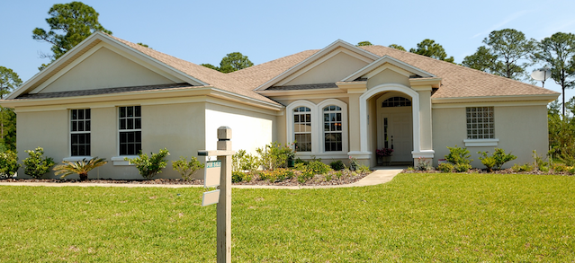
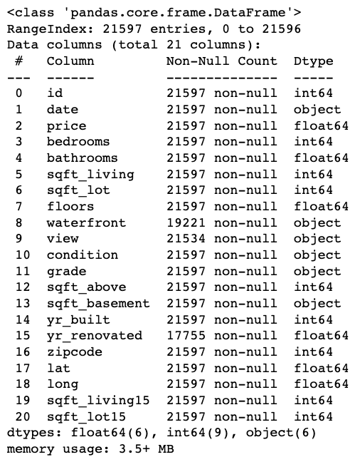
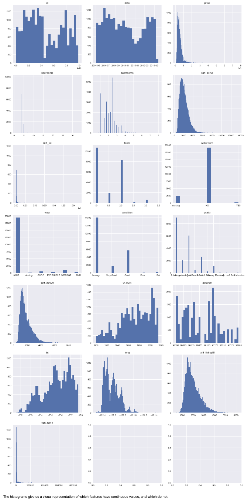
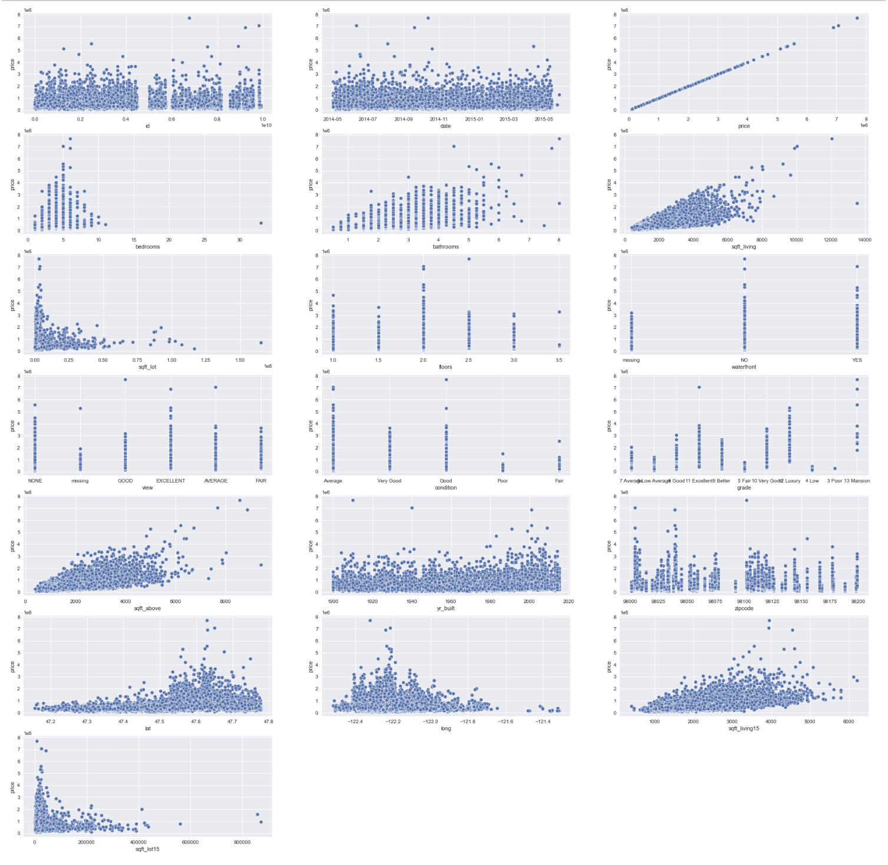
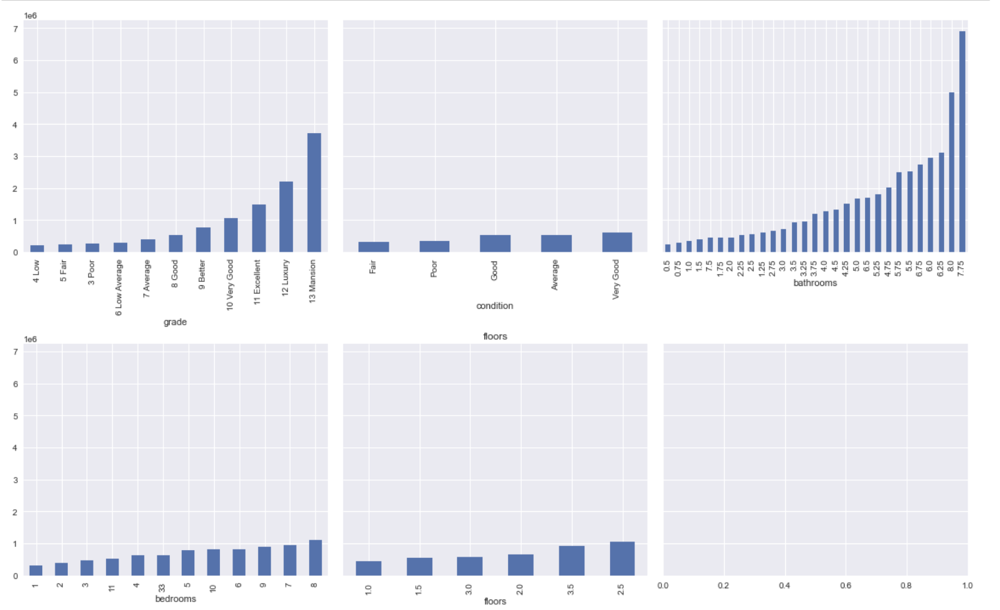
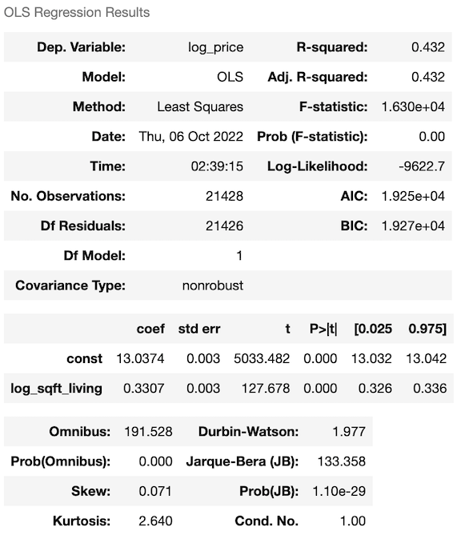

# Using a Linear Regression Model to Predict Home Prices Based on Changes Made to the Home
**Author**: Freddy Abrahamson

## Overview
For this project, I will use multiple linear regression modeling to analyze house sales in King County, in Washington state.

## Business Problem
The goal of this project is to to provide advice to homeowners about how home renovations may increase the value of their homes, and by what amount. The information for this project is derived from data comprised of the different characteristics of over 20,000 homes in King County,which is located in Washington State. I will use this information gain a better understanding about how different remodels, or renovations to the homes listed, impact their price. 


## Data Understanding
***
The data comes from the King County House Sales dataset, in the form of a 'csv' file. The file will be converted into a pandas dataframe. It contains information about the different characteristics of the homes in the King County area,including the number of bedrooms, building grades, square footage, and price. King County is located in Washington State, and has a size of approximately 2300 square miles, per the U.S Census Bureau:

kc_house_data.csv


I will be giving this dataframe a brief overview of its different characteristics, with a view toward using its columns as variables in a regression model. These include:

* dataframe shape: the number of rows and columns in the dataframe
* any missing/null values
* continuous variables
* categorical variables
* binary variables
* zero inflated variables
* outliers

Since the goal is to try to gain insights, as to how much a particular upgrade or remodel can the impact the
price of a house, as opposed to predicting home prices, I will be placing an emphasis on choosing features with the least explanatory overlap. To that end, for instance, I would favor a feature such as a bedroom, or a bathroom over square footage.<br><br><br>

**<font size='4'>The following includes dataframe information, as well as plots and histograms describing the data:</font>**<br><br>
<br><br>
<br>
**<font size='3'>Above are the histograms of the distribtutions of the different features.</font>**<br><br>
<br>
**<font size='3'>Above are scatter plots of the change of the different features, relative to the price.</font>**<br><br><br>
<br>
**<font size='3'>Above are bar plots used to visualize monotonicity in categorical features.</font>**<br><br><br>

**<font size='3'>Data Understanding Take-aways So Far:</font>**<br>
1. There appear to be eight categorical variables: 
 - bedrooms 
 - bathrooms
 - floors
 - view
 - condition
 - grade
 - waterfront
 - zipcode
<BR> 
2. There appear to be several potential zero inflated variables:
 - sqft_lot
 - waterfront
 - view
 - sqft_lot15
<BR>
3. There are also several right-skewed distributions, that may be normalized by a log transformation:
- sqft_lot
- sqft_lot15
- sqft_above
<BR>
4. Sqft_living appears to have the strongest correlation with price. Sqft_above and bathrooms, also 
    appear to have a pretty strong linear relationship with price.
<BR>  
5.  Since the relationship between the ordinal variables (grade,condition, bathrooms,bedrooms) are not repectively monotonic, some of the results given by the regression model may appear non-sensical.
<BR>
6. The descriptive analysis, as well as the visualizations show that there are outliers. I will 
    begin by removing these.<br><br>

## Preprocessing Data
- outliers based on the target were removed
- right skewed continuous features were log transformed
- some features were dropped due to missing data, zero inflated, not useful, etc.
- categorical features wer encoded
- features were scaled

## Baseline Model
<br>
baseline_model_revised.png


## Feature Selection
<font size='3'>- I created 13 models.</font><br>
<font size='3'>- For each I was either removing features with high p-values, or removing features or rows in an attempt to satisfy the assumptions of linear regression.</font><br>
<font size='3'>- The threshold for removing a feature was a p-value greater than or equal to .05.</font><br>
<font size='3'>- I also removed features that had correlation with other features that were greater than 0.75 .</font><br><br>


# Renovation and Remodel Recommendations

**<font size='3'>Baseline model:</font>**<br>
**<font size='3'>'const': 1</font>**<br>
**<font size='3'>'lat': 47.56</font>**<br>
**<font size='3'>'bedrooms': 1 (default)</font>**<br>
**<font size='3'>'bathrooms': 0.5 (default)</font>**<br>
**<font size='3'>'floors': 1 (default)</font>**<br>
**<font size='3'>'log_sqft_lot': 9</font>**<br>
**<font size='3'>'price' : 13.113682471133828  aprox.: $495678.33</font>**<br><br><br><br>


## 1. Upgrade to Three Bathrooms:
After upgrading to 3 bathrooms the log_price is : 13.184882922583839
In this case, we have a log-level regression, where the dependent variable 'price', is log transformed, and the independent variable 'bthrm__3.0' is not. It takes the following form:

ln y = b0 + b1(x) + E

where b0 is the constant, b1 is the slope coefficient, and E is the error term.


We can calculate the change in price, based on the change in x with the following formula:

                        %(change in y) = 100 * ((e^b1) - 1)
                        %(change in y) = 100 * ((e^0.071003) - 1)
                        %(change in y) = 100 * ((1.0735844) - 1)
                        %(change in y) = 7.35844%
where: b1 = 0.071003

If we compare the e^log price value to the one where we multiply the baseline house price by multiplying by its change percentage wise, we get:

                        e ^ 13.184882922583839 = 495776.25 * 1.0735844
                                    $532257.63 = $532257.65
There is a difference of only two pennies, which may have been caused in part because I rounded the percentage value.

Note: When dealing with categorical values, this log-level formula works only when comparing the prices to the default (dropped) values.
br><br><br><br>


## 2. Upgrade to Two and a Half Floors:
After upgrading to 2.5 floors, the log_price is: 13.382565260322977
In this case, we have a log-level regression, where the dependent variable 'price', is log transformed, and the independent variable 'flr__2.5' is not. It takes the following form:

ln y = b0 + b1(x) + E

where b0 is the constant, b1 is the slope coefficient, and E is the error term.


We can calculate the change in price, based on the change in x with the following formula:

                        %(change in y) = 100 * ((e^b1) - 1)
                        %(change in y) = 100 * ((e^0.197682) - 1)
                        %(change in y) = 100 * ((1.2185748) - 1)
                        %(change in y) = 21.85748%
where: with b1 = 0.197682

If we compare the e^log price value to the one where we multiply the baseline house price by multiplying by its change percentage wise, we get:

                        e ^ 13.382565260322977 = 532257.63 * 1.2185748
                                    $648595.97 = $648595.74
There is a difference of only twentythree cents, which may have been caused in part because I rounded the percentage value.

Note: When dealing with categorical values, this log-level formula works only when comparing the prices to the default (dropped) values.
<br><br><br>


## 3. Increasing Living Space to 2500 Square Feet::
After upgrading to 2.5 floors, the log_price is: 13.5359042176324
In this case, we have a log-log regression, where the dependent variable 'price', is log transformed, and the independent variable 'log_sqft_living' is log transformed as well. It takes the following form:

ln y = b0 + b1(x) + E

where b0 is the constant, b1 is the slope coefficient, and E is the error term.


We can calculate the change in price, based on the change in x with the following formula:

                        %(change in y) = b1 * %(change in x)
                        %(change in y) = (100 * ((new_x - x) / x) * b1)%
                        %(change in y) = (100 * ((2499.88497551 - 1881.83002516) / 1881.83002516) * b1)%
                        %(change in y) = (100 * ((618.05495035) / 1881.83002516) * b1)%
                        %(change in y) = (100 * 0.32843293075 * 0.539926)%
                        %(change in y) = 17.7329478568%
where: b1 = 0.539926
x = current log_sqft_living = (e ^ 7.54) = 1881.83002516
new_x = new log_sqft_living = (e ^ 7.824) = 2499.88497551


If we compare the e^log price value to the one where we multiply the baseline house price by multiplying by its change percentage wise, we get:

                        e ^ 13.5359042176324 = 648595.97 * 1.177329478568
                                    $756081.32 = $763611.16
This gives us a difference of less than 1%, which may have been caused in part due to rounding of certain numbers.
<br><br><br><br>


## Project Conclusion: Main Take-aways
**<font size='3'> 1. It is critical to have some understanding of the subject matter one is dealing with, in order to be able to select features, more effectively, and root out non-sensical results.</font>**<br>
**<font size='3'>2. If the ordinal data in one's data set does not have a monotonic relationship, one may wind up with non-sensical results. For example, recommending a downgrade from 'grd_10 Very Good' to 'grd_9 Better', in order to increase the price of the home.</font>**<br>
**<font size='3'>3. High multi-colinearity between features, may lead to unexpected results. For example, one may have two features that are highly correlated, where both have positive Pearson correlations, but one has a negative regression coefficient.</font>**<br>
**<font size='3'>4. The features with the higher Perason correlation coefficient, do not necessarily have a higher regression coefficient. I found this particularly in the 'dummy' variables. I think this may have something to do with these variables not having an equal number of occurences, since only one can be chosen at a time, for each row of data.</font>**<br>
**<font size='3'>5. I understand that the distribution of the residuals do not necessarily have to be perfectly normal, but I am not clear as to what is defined as 'normal enough'.</font>**<br>
**<font size='3'>6. I may have been able to further improve the R-squared score by adding 'sqft_bsmnt' as a binary variable.</font>**<br>
**<font size='3'>7. I originally planned to associate the zip codes with their corresponding average household incomes (per the U.S census bureau),then binning by income groups, and creating interactions, but ultimately decicded against it because it generated too many columns, and didn't lend itself to learning.</font>**<br>
**<font size='3'>8. Log transforming the dependent variable can help approximate a normal residual distribution.</font>**<br>
**<font size='3'>9. Remove rows with outliers in the dependent variable can help approximate a normal residual distribution.</font>**<br><br><br><br>


## For More Information

Please review my full analysis in [my Jupyter Notebook](./student.ipynb) or my[presentation](./DS_Project_Presentation.pdf).<br>
For any additional questions, please contact **Freddy Abrahamson at fred0421@hotmail.com**,<br><br>

## Repository Structure

```
├── README.md                                    <- The top-level README for reviewers of this project
├── student.ipynb                                <- Narrative documentation of analysis in Jupyter notebook
├── Phase_2_Project_Presentation.pdf             <- PDF version of project presentation
├── CONTRIBUTING.md                              <- Contributing to Learn.co Curriculum
├── LICENSE.md                                   <- Learn.co Educational Content License
└── images                                       <- Images used for this project
```
