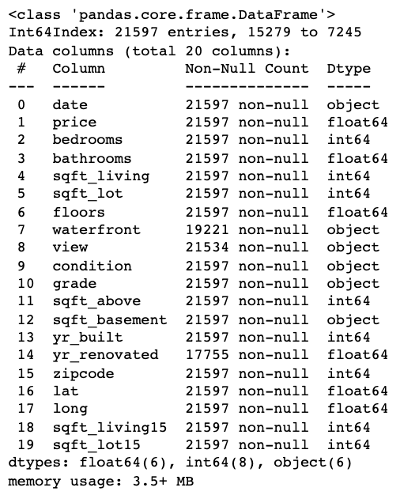

**Author**: Freddy Abrahamson

## Overview
For this project, I will use multiple linear regression modeling to analyze house sales in King County, in Washington state.

## Business Problem
The goal of this project is to to provide advice to homeowners about how home renovations may increase the value of their homes, and by what amount. The information for this project is derived from data comprised of the different characteristics of over 20,000 homes in King County,which is located in Washington State. I will use this information gain a better understanding about how different remodels, or renovations to the homes listed, impact their price. 


## Data Understanding
***
The data comes from the King County House Sales dataset, in the form of a 'csv' file. The file will be converted into a pandas dataframe. It contains information about the different characteristics of the homes in the King County area,including the number of bedrooms, building grades, square footage, and price. King County is located in Washington State, and has a size of approximately 2300 square miles, per the U.S Census Bureau:

kc_house_data.csv


I will be giving this dataframe a brief overview of its different characteristics, with a view toward using its columns as variables in a regression model. These include:

* dataframe shape: the number of rows and columns in the dataframe
* any missing/null values
* continuous variables
* categorical variables
* binary variables
* zero inflated variables
* outliers

Since the goal is to try to gain insights, as to how much a particular upgrade or remodel can the impact the
price of a house, as opposed to predicting home prices, I will be placing an emphasis on choosing features with the least explanatory overlap. To that end, for instance, I would favor a feature such as a bedroom, or a bathroom over square footage.<br><br><br>

**<font size='4'>The following includes dataframe information, as well as plots and histograms describing the data:</font>**<br><br>
<br>
**<font size='3'>Above is information about the dataframe (after 'id' column was dropped).</font>**<br><br>
<br>
**<font size='3'>Above are the histograms of the distribtutions of the different features.</font>**<br><br>
<br>
**<font size='3'>Above are scatter plots of the change of the different features, relative to the price.</font>**<br><br><br>

**<font size='3'>Data Understanding Take-aways So Far:</font>**<br>
1. There appear to be six categorical variables: 
 - bedrooms 
 - bathrooms
 - floors
 - view
 - condition
 - grade
<BR>
2. There is atleast one binary variable:
 - waterfront
<BR> 
3. There appear to be several potential zero inflated variables:
 - sqft_lot
 - sqft_basement
 - yr_renovated
 - sqft_lot15
<BR>
4. There are also several right-skewed distributions, that may be normalized by a log transformation 
<BR>
5. Sqft_living appears to have the strongest correlation with price. Sqft_above and bathrooms, also 
    appear to have a pretty strong linear relationship with price.
<BR>  
6.  Since the relationship between the ordinal variables (grade,condition, bathrooms,bedrooms) are not repectively         monotonic, some of the results given by the regression model may appear non-sensical.
<BR>
7. The descriptive analysis, as well as the visualizations show that there are outliers. I will 
    begin by removing these.<br><br>
## Preprocessing Data

<font size='3'>In this section, I will deal with incorrect data types, as well as missing , or 'zero-inflated' data. I will also create the categorical 'dummy' columns , as well as perform transformations on continuous data if necessary. I also created two 'preprocessed' dataframes, one that is scaled, and one that is not. Once I have all my final features, I will create another model with the identical set of features that are not scaled. It makes for an easier interpretation of the individual variables.</font>**<br>

**<font size='3'>The following is a description of the scaled dataframe after the preprocessing was completed:</font>**<br>
<br><br><br>

## Feature Selection
<font size='3'>In this section I created the following three baseline models:</font><br>
<font size='3'>1. The feature with the highest correlation to the dependent variable (price)</font><br>
<font size='3'>2. The dataframe with all the features, as well as 'dummy' features, log transormations</font><br>
<font size='3'>3. In this dataframe I have dropped some 'generalized' features with high explanatory overlap.</font><br><br>
<font size='3'>Continuing with the third baseline model, I repeatedly remove features with p-values over.05, and features with high multi-colinearity. The following is the final model before I begin to confirm the assumptions of linear regression. At this point there are actually two models, that are identical except one has the 'lat' feature and one does not. This is because at this point I am not sure if I should remove the 'lat' feature in order to lower the Jarque Bera score.</font><br>

**<font size='3'>Model with 'lat' feature:</font>**<br>
<br><br><br>

**<font size='3'>Model without 'lat' feature:</font>**<br>
<br><br><br>

## Assumptions of Multiple Linear Regression
**<font size='3'>In this section I had to remove some rows in order to satisfy the assumptions of homoscedasticity, and normality of the residuals. This is the final model after all the assumptions were satisfied:</font>**<br>
<br><br><br>


## Renovation and Remodel Recommendations

**<font size='3'>Baseline model:</font>**<br>
**<font size='3'>'const': 1</font>**<br>
**<font size='3'>'lat': 47.56</font>**<br>
**<font size='3'>'view': 'AVERAGE' (default)</font>**<br>
**<font size='3'>'condition': 'AVERAGE' (default)</font>**<br>
**<font size='3'>'grade': '10 Very Good' (default)</font>**<br>
**<font size='3'>'waterfront': 'NO' (default)</font>**<br>
**<font size='3'>'bedrooms': 1 (default)</font>**<br>
**<font size='3'>'bathrooms': 0.5 (default)</font>**<br>
**<font size='3'>'floors': 1 (default)</font>**<br>
**<font size='3'>'log_sqft_lot': 9</font>**<br>
**<font size='3'>'price' : 12.855537576059533 aprox.: 382903.231151</font>**<br><br><br><br>


## 1. Adding a Second Floor:
**<font size='3'>The following is the price predicted by the model when the baseline model is changed from 1 floor, to 2 floors. The result is the power to which Euler's number (e) should be raised, in order to derive the price:</font>**<br>
<br><br>
**<font size='3'>In this case, we have a log-level regression, where the dependent variable 'price', is log transformed, and the independent variable 'flr__2.0'  is not. It takes the following form:</font>**<br>
**<font size='3'>ln y = b0 + b1(x) + E</font>**<br>
**<font size='3'>where b0 is the constant, b1 is the slope coefficient, and E is the error term.</font>**<br>
**<font size='3'>We can calculate the change in price, based on the change in x with the following formula:</font>**<br>
**<font size='3'>%(change in y) = 100 * ((e^b1) - 1)</font>**<br>
**<font size='3'>Based on this formula, with b1 = 0.0864, the change in y would be equal to 9.02423%. If we multiply 382,903.231151 by 1.0902423, we get 417,457.299407. If we compare 
this to the price predicted by the model in terms of an exponent,e^12.941941308413988 = 417458.872072. The log-level interpretation matches the predicted value with a precision of   99.99962328%.</font>**<br><br><br><br>


## 2. Upgrading Building Grade to 'grd_11 Excellent':
**<font size='3'>The following is the price predicted by the model when the baseline model is changed from grade 10 to grade 11. The result is the power to which Euler's number (e) should be raised, in order to derive the price:</font>**<br>
<br><br>
**<font size='3'>In this case, we have a log-level regression, where the dependent variable 'price', is log transformed, and the independent variable 'grd_11 Excellent'  is not. It takes the following form:</font>**<br>
**<font size='3'>ln y = b0 + b1(x) + E</font>**<br>
**<font size='3'>where b0 is the constant, b1 is the slope coefficient, and E is the error term.</font>**<br>
**<font size='3'>We can calculate the change in price, based on the change in x with the following formula:</font>**<br>
**<font size='3'>%(change in y) = 100 * ((e^b1) - 1)</font>**<br>
**<font size='3'>Based on this formula, with b1 = 0.5802, the change in y would be equal to 78.639567%. If we multiply 382,903.231151 by 1.78639567, we get 684,016.674157. If we compare this to the price predicted by the model in terms of an exponent, e^13.43576963632787 = 684,038.60586. The log-level interpretation matches the predicted value with a precision of 99.996793791%.</font>**<br><br><br><br>


## 3. Upgrading to Four Bedrooms:
**<font size='3'>The following is the price predicted by the model when the baseline model is changed from 1 bedroom to 4 bedrooms. The result is the power to which Euler's number (e) should be raised, in order to derive the price:</font>**<br>
<br><br>
**<font size='3'>In this case, we have a log-level regression, where the dependent variable 'price', is log transformed, and the independent variable 'bdrm__4' is not. It takes the following form:</font>**<br>
**<font size='3'>ln y = b0 + b1(x) + E</font>**<br>
**<font size='3'>where b0 is the constant, b1 is the slope coefficient, and E is the error term.</font>**<br>
**<font size='3'>We can calculate the change in price, based on the change in x with the following formula:</font>**<br>
**<font size='3'>%(change in y) = 100 * ((e^b1) - 1)</font>**<br>
**<font size='3'>Based on this formula, with b1 =  0.0758, the change in y would be equal to 7.87468%. If we multiply 382,903.231151 by 1.0787468, we get 413,055.635314. If we compare this to the price predicted by the model in terms of an exponent, e^12.931293218903669 = 413,037.31498. The log-level interpretation matches the predicted value with a precision of   99.995564681%.</font>**<br><br><br><br>


## Project Conclusion: Main Take-aways
**<font size='3'> 1. It is critical to have some understanding of the subject matter one is dealing with, in order to be able to select features, more effectively, and root out non-sensical results.</font>**<br>
**<font size='3'>2. If the ordinal data in one's data set does not have a monotonic relationship, one may wind up with non-sensical results. For example, recommending a downgrade from 'grd_10 Very Good' to 'grd_9 Better', in order to increase the price of the home.</font>**<br>
**<font size='3'>3. High multi-colinearity between features, may lead to unexpected results. For example, one may have two features that are highly correlated, where both have positive Pearson correlations, but one has a negative regression coefficient.</font>**<br>
**<font size='3'>4. The features with the higher Perason correlation coefficient, do not necessarily have a higher regression coefficient. I found this particularly in the 'dummy' variables. I think this may have something to do with these variables not having an equal number of occurences, since only one can be chosen at a time, for each row of data.</font>**<br>
**<font size='3'>5. I understand that the distribution of the residuals do not necessarily have to be perfectly normal, but I am not clear as to what is defined as 'normal enough'.</font>**<br>
**<font size='3'>6. I may have been able to further improve the R-squared score by adding 'sqft_bsmnt' as a binary variable.</font>**<br>
**<font size='3'>7. I originally planned to associate the zip codes with their corresponding average household incomes (per the U.S census bureau),then binning by income groups, and creating interactions, but ultimately decicded against it because it generated too many columns, and didn't lend itself to learning.</font>**<br>
**<font size='3'>8. Log transforming the dependent variable can help approximate a normal residual distribution.</font>**<br>
**<font size='3'>9. Remove rows with outliers in the dependent variable can help approximate a normal residual distribution.</font>**<br><br><br><br>


## For More Information

Please review my full analysis in [my Jupyter Notebook](./student.ipynb) or my[presentation](./DS_Project_Presentation.pdf).<br>
For any additional questions, please contact **Freddy Abrahamson at fred0421@hotmail.com**,<br><br>

## Repository Structure

```
├── README.md                                    <- The top-level README for reviewers of this project
├── student.ipynb                                <- Narrative documentation of analysis in Jupyter notebook
├── Phase_2_Project_Presentation.pdf             <- PDF version of project presentation
├── CONTRIBUTING.md                              <- Contributing to Learn.co Curriculum
├── LICENSE.md                                   <- Learn.co Educational Content License
└── images                                       <- Images used for this project
```
